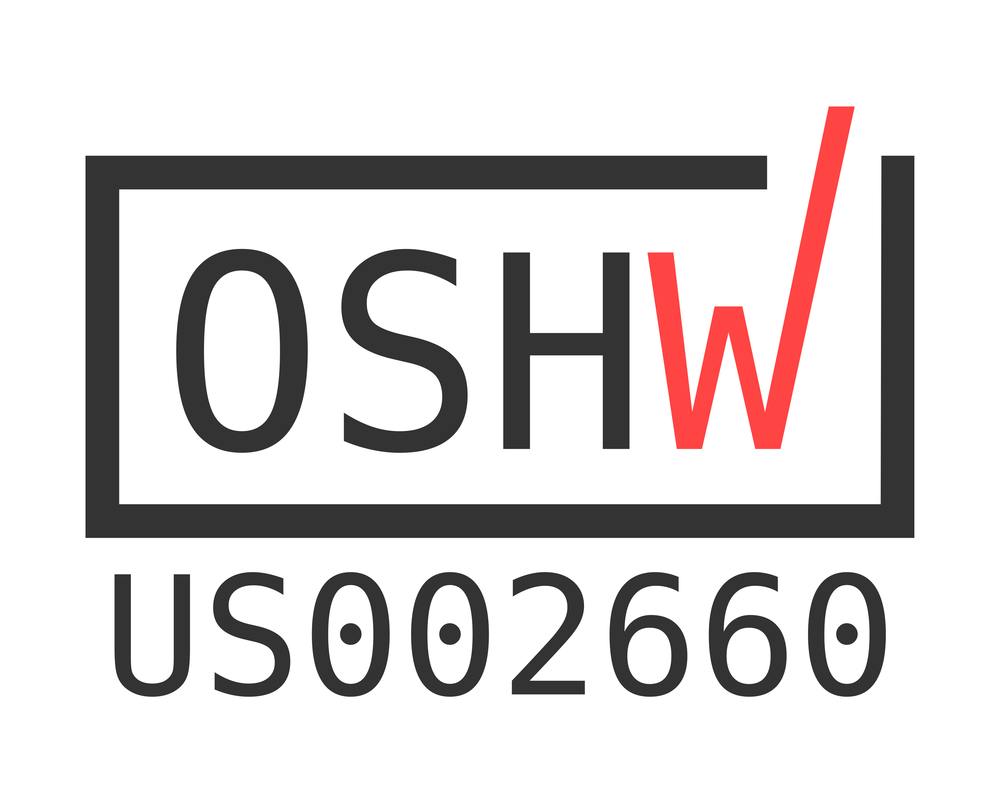
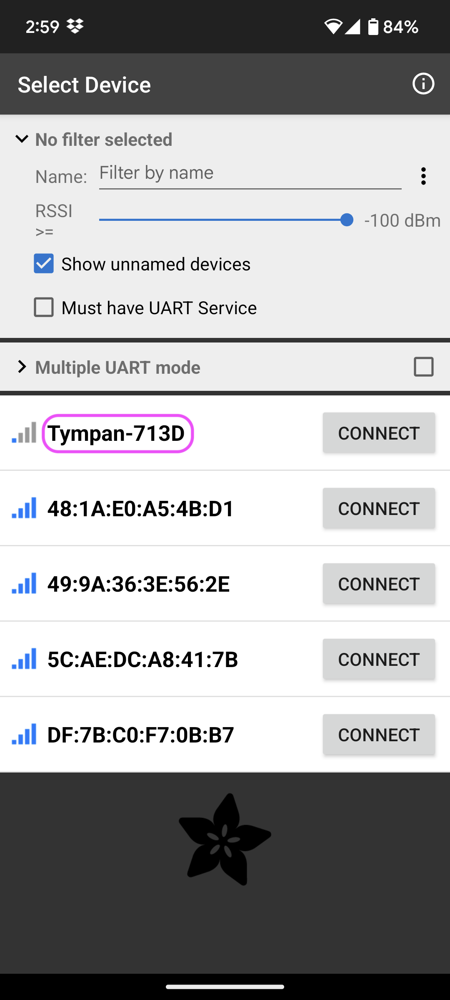
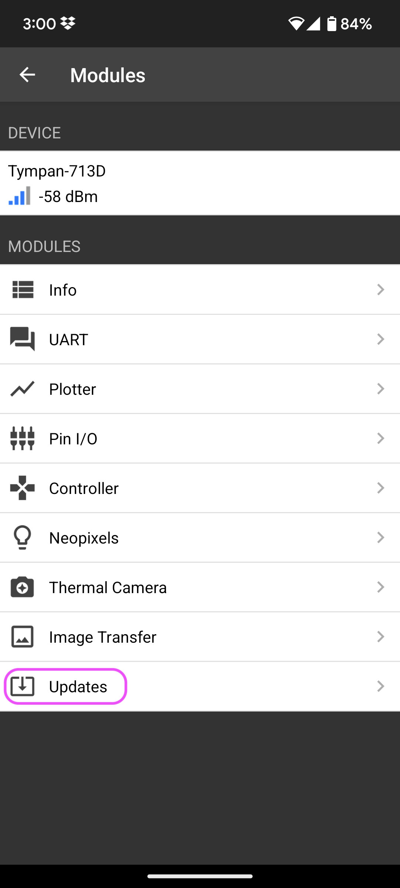
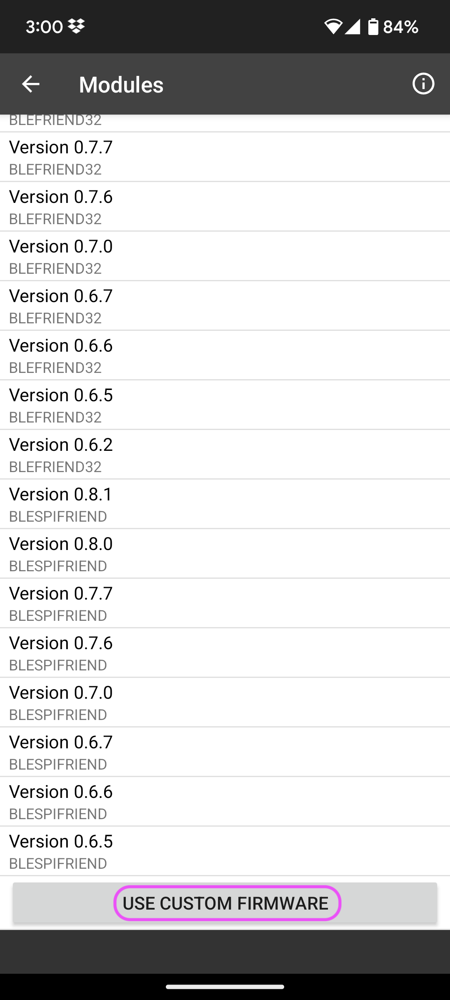
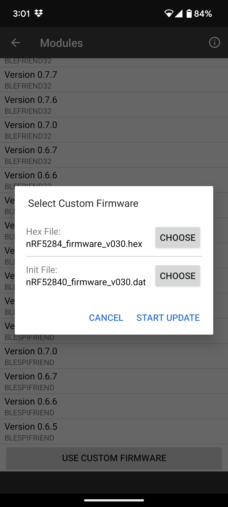
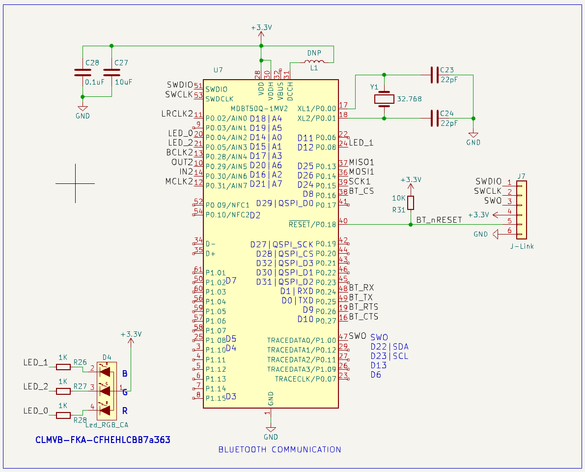
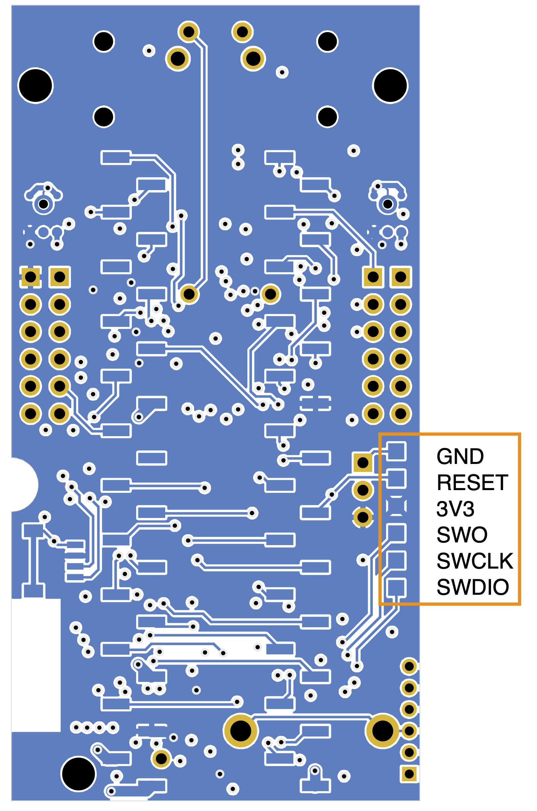

# Tympan Rev F Hardware
Tympan Rev F Hardware Design Files For First Production Run, Februrary, 2024.

Tympan is Certified Open Source Hardware!

## Changes From Rev E
For the most part, the design of Rev F is a clone of Rev E. The primary challenge of producing Rev E is that the BC127 BLE Radio module we used is not longer available (Product End Of Life). Here are the major changes in the hardware

- Changed to nRF52840 BLE Radio Module
	- Using part number MDBT50Q-1MV2 from Raytac
	- Module requires bootloader, we use Adafruit Feather nRF52840 Express bootloader
	- Bootloading blank module proceedure see below
- nRF52 does not support analog audio, but evidence exists that it can use I2S
	- I2S connections between Teensy 4.1 and nRF52 on I2S_2 pins
- UART coms with the BC127 were slower than desired
	- The SPI_1 bus is connected to nRF module for higher speed
	- The UART pins are still connected

# Programming The Radio Module

## Over The Air Firmware Updates
Any updates to the application software can be done over Bluetooth using Over The Air Device Firmware Update (OTA DFU). This tutorial will use Adafruit's Bluefruit Connect app, which is available for iPhone and Android.

You will also need two files to upload which Arduino makes when. One is the `.hex` file, The other is a `.dat` file. The latest version of our Tympan Radio firmware is published as a release on this repository, which you can download [HERE](https://https://github.com/Tympan/Tympan_Rev_F_Hardware/archive/refs/tags/v0.3.1.zip) The link will start downloading a zip with the necessary files inside it. Both of these files need to be accessible on the phone, or tablet, that you intend to use to perform the OTA DFU. When you have the files on your mobile device, open up the Bluefruit App, and connect to the Tympan that you want to update. Each Tympan advertises it's name followed by a unique ID. Click on connect.

After connecting, the app will show you various tools. Scroll to the bottom and select the Updates tool.

There is a long list of updates that are for Adafruit's BLE products. Scroll all the way to the bottom and select Custom Firmware.

The pop-up window will ask you to choose the Hex and Init files. Navigate to the place where you have stored the files you downloaded from our latest release. Choose our hex file for the .hex, and our dat file for the Init file. When you press START UPDATE, the process will begin, and the upload will show a progress bar.

That's it! After successful upload, your Tympan Radio will be running the latest and greatest firmware version. If you want to continue to use the Bluefruit App, it is advised to close the close it after the upload process is complete, and then restart if you intend to use it again right away.

# Wired Firmware Updates

**NOTE: This method is included here for completion. OTA DFU should suffice of all updates**

The blank nRF52 module is programmable using the j-Link connection on pins SWO, SWCLK, SWDIO, RESET, 3V3, and GND. Those module pins are broken out to a header row on the bottom of the board. See connector J7 in the schematic, and the 6 SMT pads on the back layer of the PCB design.

-

### Programming Fixture

We have a specific PCB card for bootloading and programming the nRF52 The folder called `Tympan nRF52 Programmer` contains design files for this PCB. This PCB is not 100% necessary for bootloading and programming the radio. As long as you make the correct connections between the J-Link programmer and the 6 pads on the bottom of the board, you will have success using the How To Program instructions below.

### Programmer

The J-Link by Segger is preferred for flashing the bootloader and any application layer onto the nRF52. You can get one from various suppliers. [Adafruit](https://www.adafruit.com/product/2209), [Mouser](https://www.mouser.com/ProductDetail/Segger-Microcontroller/8.08.00?qs=jA5Ki6243on%2Fr15wFqMuRQ%3D%3D), [Digikey](https://www.digikey.com/en/products/detail/segger-microcontroller-systems/8-08-28/4476087) all carry them.

Adafruit also sells a [low-cost J-Link](https://www.adafruit.com/product/3571) for educational purposes. The EDU version is specifically not for use in commercial applications. If you need to re-program your radio from the bootloader up, your personal use of the EDU version will not break that rule!

## Programming With Hardware Connection

There are a couple of routes through different toolchains that are available to bootload the nRF52 module using the J-link. Our current method uses Command Line Tools from Nordic, the makers of the nRF52 chipset. Download the [Command Line Tools](https://www.nordicsemi.com/Products/Development-tools/nrf-command-line-tools/download), and install them to `Program Files (x86)`. You will also need one element of the Adafruit nRF52 toolset, which means that you need to install it through the Arduino IDE, as described in the section below "Compiling the Firmware".

**>>> NOTE: This tutorial currently only supports Windows OS**

The other software that you need is Arduino IDE, which is assumed to be installed and updated to the latest version. Arduino will very tidily create the proper compiled files for flashing. Click on `Sketch > Export Compiled Binary` and the IDE will create a folder called `build` inside your Sketch folder. The build folder contains a subfolder specific to the board. Click on `Sketch > Show Sketch Folder` to open it in an explore window. Inside the subfolder you will find 4 files.

- ELF
- HEX
- MAP
- ZIP

Each file is used for different Device Firmware Update (DFU) processes. For the purpose of initial flashing via J-Link, we will use the `.hex` file. You may note that the full name of the file is something like `TympanRadio_baseFirmware.ino.hex`. The inclusion of the .ino in the name should not cause a problem, but if you want you can change the name and remove the .ino. Just make sure to keep the .hex suffix.

We will be flashing a blank nRF52 module with Adafruit's Feather Express bootloader variant. The file we need is a `.hex` file, and it is located in `C:\Users\{USERNAME}\AppData\Local\Arduino15\packages\adafruit\hardware\nrf52\1.6.0\bootloader\feather_nrf52840_express\feather_nrf52840_express_bootloader-0.8.0_s140.6.1.1.hex`. We recommend making a copy of it, and moving it into the same folder that the IDE just made to keep things tidy.

Open a Command Prompt window, and navigate to `C:\Program Files (x86)\Nordic Semiconductor\nrf-command-line-tools\bin`, and then enter the following commands:

`nrfjprog --program {PATH}\feather_nrf52840_express_bootloader-0.8.0_s140_6.1.1.hex --format NRF52 --chiperase --reset && nrfjprog --memwr 0xFF000 --val 0x01 && nrfjprog --reset --program {PATH}\TympanRadio_baseFirmware.ino.hex --sectorerase --format NRF52 --verify --log`

The first command flashes the bootloader and the Bluetooth soft device. The second command sets a bit in 0xFF000 in order to bypass 'virgin program' hurdle. The third command programs the application software. 

## Compiling the Firmware
Ideally, you do not need to compile the firmware; you would just use the pre-compiled HEX file already included with this repository.  But, if you do need to re-compile:
* Install the Arduino IDE.
* Via the Arduino "Boards Manager", install support for "Adafruit nRF52".
  * In the Arduino IDE, go under the File menu and choose "Preferences"
  * Under "Additional Board Manager URL", add https://adafruit.github.io/arduino-board-index/package_adafruit_index.json
  * Restart the Arduino IDE
  * Open the Boards Manager from the Tools -> Board menu and install "Adafruit nRF52 by Adafruit" (this might take a few minutes)
* Clone this "Tympan Rev F Hardware" repo to your local computer
 
Once everything is installed, use the Arduino IDE to open "nRF52840_firmware.ino" that is here in the Tympan Rev F repository.  You need to tell the Arduino IDE what hardware you are programming for:
* Under the "Tools" menu, choose "Board" and set it to "Adafruit Feather nRF52840 Express".

Now you can make any changes you want to the code.  When done, compile.  The Arduino IDE cannot upload the firmware directly to the nRF58240 in the Tympan.  Instead, you must use the "hardware connection" or "over the air" methods described in the sections above. To get the HEX and DAT files for these methods:
* In the Arduino IDE, under the "Sketch" menu, choose "Export Compiled Binary"
